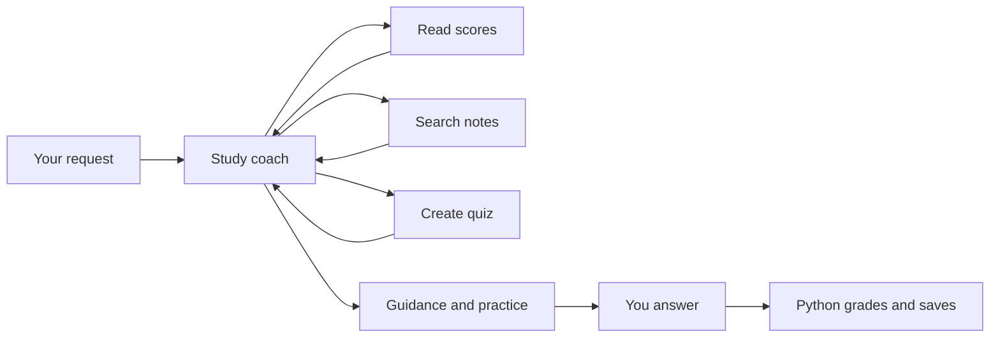

<p align="center">
  
</p>

# StudyTrail

**Learn a little. Practise with purpose. See your progress.**

StudyTrail is a personal AI study coach that runs in your terminal. Ask a question,
practise with a quiz, and get guidance informed by your saved results and study notes.
It is also a small, readable Python project for learning how tool-using agents work.

**Python 3.12 · Groq · Local progress · Contributions welcome**

[Get started](#get-started) · [Start studying](#start-studying) ·
[Add notes](#bring-your-own-notes) · [Contribute](#contributions-welcome) ·
[User guide](docs/USER_GUIDE.md)

## What can I do with it?

- **Learn:** ask for an explanation or a short study plan.
- **Practise:** take multiple-choice quizzes and review answer explanations.
- **Reflect:** ask the coach what to study next based on your saved scores.
- **Use your notes:** search local Markdown and text files for relevant material.
- **Explore agents:** see when the model calls tools and follow the Python code.

The current coaching instructions, bundled notes, and offline demo focus on
**Python**. You can try other subjects with an explicit request and your own notes,
but consistent multi-subject coaching is still an improvement to contribute.

## Get started

The commands below use **Windows PowerShell**. Keep the project and its isolated
Python environment under `C:\CLAUDE_env`.

### 1. Open the project and install dependencies

Download or clone this repository into `C:\CLAUDE_env\Study_Agent_python`.
If you already have the project there, simply open that folder.

Install [uv](https://docs.astral.sh/uv/getting-started/installation/) if needed,
then run:

```powershell
cd C:\CLAUDE_env\Study_Agent_python
uv sync --locked
```

This creates a `.venv` and installs the project dependencies into it. No system
Python packages need to be changed. No GPU is required.

### 2. Try it without an API key

```powershell
uv run python -m study_agent demo
```

The offline demo gives you three fixed questions about Python loops. It uses no
API calls and keeps demo scores separate from your real study progress. It is a
walkthrough of the local features, not a live AI conversation.

### 3. Connect Groq for live coaching

Create a key in [Groq Console](https://console.groq.com/keys). Stay on the **Free
plan** to use its free allowance. Request and token limits apply; a paid account
is not made free by this app. See [Groq's limits](https://console.groq.com/docs/rate-limits).

Create your local settings file only if it does not already exist:

```powershell
if (-not (Test-Path .env)) { Copy-Item .env.example .env }
notepad .env
```

Fill in your key locally and save:

```dotenv
GROQ_API_KEY=your-groq-api-key
GROQ_MODEL=openai/gpt-oss-120b
```

The model runs on **Groq**. The `openai/` part identifies the model developer;
you do not need an OpenAI API key or subscription.

Keep credentials in `.env`, which Git ignores. Leave `.env.example` free of real keys.

### 4. Start your study session

```powershell
uv run python -m study_agent doctor
uv run python -m study_agent chat
```

`doctor` checks local configuration. It does not contact Groq or verify your key.
The first chat request uses the live API.

**Already installed, but `uv` is not recognised?** Use the existing environment:

```powershell
& .\.venv\Scripts\python.exe -m study_agent chat
```

If the environment is activated and your prompt shows `(.venv)`, this also works:

```powershell
python -m study_agent chat
```

Run these commands from the project folder. Start the app once, then type your
requests at its `You:` prompt. Enter `/quit` and restart after changing `.env`.

## Start studying

At the `You:` prompt, try:

```text
Help me practise Python loops with 2 beginner questions.
```

A typical session looks like this. Tool choices and wording can vary:

```text
You: Help me practise Python loops with 2 beginner questions.
  Tool: get_scores
  Tool: search_notes
  Tool: create_quiz

Coach: Your quiz is ready.
Take it now? [y/N]: y
```

Choose **A, B, C, or D** for each question. After submission, the app saves your
score and shows explanations. Enter **Q** during a quiz to leave without submitting;
resuming starts that quiz again from question one.

Then try:

```text
Review my scores and suggest what I should practise next.
Explain break and continue using my notes.
Create a short study plan for my weakest topic.
```

**Inside chat:** `/scores` shows progress, `/pending` lists unfinished quizzes,
and `/quit` exits. Completed quiz results survive restarts; chat history does not.

### Useful terminal commands

Run these at the PowerShell prompt, not at the agent's `You:` prompt:

```powershell
uv run python -m study_agent scores
uv run python -m study_agent pending
uv run python -m study_agent quiz QUIZ_ID
uv run python -m study_agent notes "loops range"
uv run python -m study_agent --help
```

Replace `QUIZ_ID` with an ID printed by the app. Add `--demo` to `scores`, `pending`,
or `quiz QUIZ_ID` when working with demo results. A completed quiz can be submitted
only once; request a new one to practise again.

## Bring your own notes

Put UTF-8 `.md` or `.txt` files in `notes/`. Use `notes/private/` for personal notes
you do not want included in Git. New notes are read when you search; no indexing
command is required.

For example, create `notes/private/java-basics.md`:

```markdown
# Java variables

Java variables have declared types.
int age = 25;
double price = 19.99;
boolean isLearning = true;
String name = "Alex";
```

Then ask:

```text
Search my Java notes. Explain Java variables and create 2 beginner questions.
Use "java variables" as the quiz topic.
```

Java is an exploratory use case: the current system instructions still favour
Python. Use distinct topic names such as `java loops` and `python loops`.

Search uses keywords rather than embeddings. PDF/image extraction is not supported,
and files over 200 KB are skipped. See the [user guide](docs/USER_GUIDE.md) for details.

## How the agent works

The model chooses tools, receives their results, and decides what to do next.
Your quiz answers are graded and saved by Python.



The three model-callable tools are `get_scores`, `search_notes`, and `create_quiz`.
`save_result` is an application function: the model cannot submit an invented score.
Model-generated questions and answer keys can still be wrong, so review explanations.

## Explore the code

```text
study_agent/
  cli.py        Terminal commands and quiz interaction
  agent.py      Coaching instructions and the tool loop
  tools.py      Allowed tools and argument validation
  models.py     Quiz data models
  notes.py      Keyword search over local notes
  storage.py    SQLite persistence and grading
  config.py     Local configuration
  demo.py       Fixed offline demonstration
notes/          Example learning material
tests/          Offline automated tests
assets/         StudyTrail logo and README banner
docs/           Detailed user guide
```

The stack is Python, the OpenAI-compatible SDK pointed at Groq, Pydantic,
python-dotenv, Rich, and SQLite. Tests use pytest; code checks use Ruff.

## Contributions welcome

**You do not need to be an AI expert to contribute.** Documentation improvements,
clearer examples, bug reports, and well-tested fixes are all useful.

Good starting points:

- Improve beginner explanations and sample notes.
- Add tests for a reproducible bug or an edge case.
- Improve accessibility and terminal usability.
- Design explicit subject selection and separate subject progress.
- Explore better retrieval with a small, measurable evaluation set.

Read [CONTRIBUTING.md](CONTRIBUTING.md) for the development workflow, checks,
and what to include in an issue or pull request. Larger changes should start with
a discussion so contributors and maintainers agree on the intended behaviour.

## Common questions

**Is it free?** The offline demo and local commands require no API usage. Live
coaching uses your Groq account's allowance. Stay on its Free plan for free usage
within limits. The app cannot check your billing tier.

**Where is my progress?** In `data/study.sqlite3`. Demo results use
`data/demo.sqlite3`. Both are local and excluded from Git.

**Why am I getting a 404?** Check that `GROQ_MODEL` names a model available to your
Groq account. The configured default is `openai/gpt-oss-120b`. Restart after editing
`.env`; an open chat does not reload settings.

**What if I hit a rate limit?** Wait for the relevant Groq limit to reset. Each
agent request can make several API calls. Offline features remain available.

**What gets sent to Groq?** Your prompts, recent in-session messages, and tool
results such as retrieved note passages and score summaries. Put only material
you intend to send to that provider in your study notes.

**Can I ask it to run my code?** No. This version does not execute generated code
or provide arbitrary file-access tools.

For configuration, troubleshooting, limits, and backup instructions, see the
[full user guide](docs/USER_GUIDE.md).

---

Built for curious learners. Improved by thoughtful contributions.
